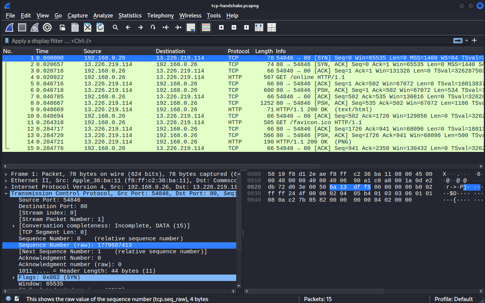
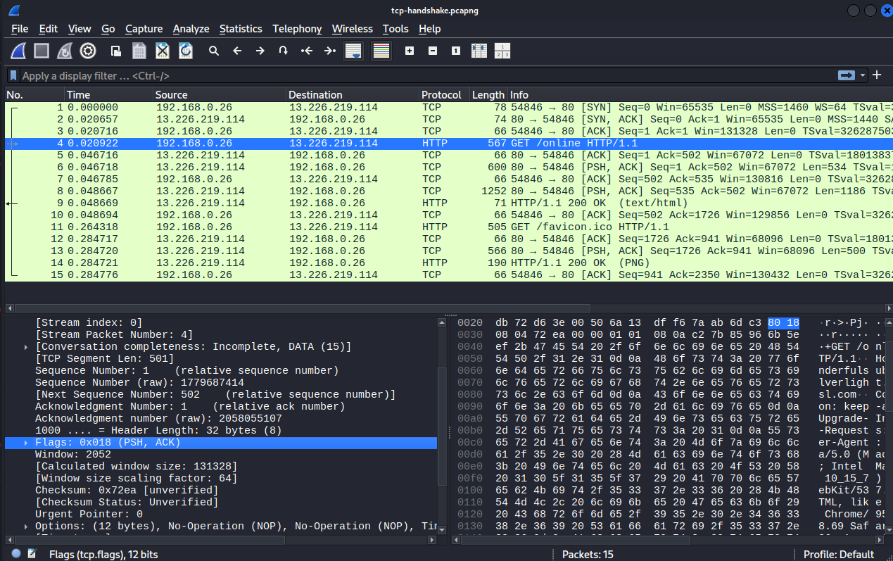

# Day 1-2: OSI Model & TCP/IP

## 📋 Overview

Deep dive into the OSI model and TCP/IP protocol suite with extensive packet analysis using Wireshark. 
Mastered the theoretical foundation and practical application of network protocols.

---

## Learning Objectives

✅ Understand all 7 OSI layers and their real-world functions  
✅ Differentiate TCP vs UDP protocols (when and why to use each)  
✅ Analyze TCP three-way handshake at packet level  
✅ Master Wireshark for network troubleshooting  
✅ Explain networking concepts to non-technical audiences  

---

## OSI Model - The 7 Layers

### **Mnemonic: "Please Do Not Throw Sausage Pizza Away"**

| Layer | Number | Name | Function | Protocol examples | Use case google.com |
|-------|--------|------|----------|-------------------|---------------------|
| **Application** | 7 | User Interface | Network services to applications | HTTP, FTP, SMTP, DNS | Browser sends HTTP GET request |
| **Presentation** | 6 | Data Translation | Encryption, compression, formatting | TLS/SSL, JPEG, ASCII | HTTPS encrypts the request with TLS |
| **Session** | 5 | Connection Management | Establishes/maintains sessions | NetBIOS, RPC | TCP session established and maintained |
| **Transport** | 4 | End-to-End Delivery | Reliability, flow control | TCP, UDP | TCP ensures reliable delivery, acknowledges packets |
| **Network** | 3 | Routing | Logical addressing, routing | IP, ICMP, OSPF | IP routes packets across internet to Google's servers |
| **Data Link** | 2 | Local Delivery | Physical addressing, error detection | Ethernet, WiFi, PPP | Ethernet frames carry data on local network |
| **Physical** | 1 | Hardware | Bits on wire, electrical signals | Cables, hubs, NICs | Electrical signals travel through cables/WiFi |

---

## 🔄 TCP vs UDP

### **TCP (Transmission Control Protocol)**

**Characteristics:**
- **Connection-oriented:** Three-way handshake before data transfer
- **Reliable:** Acknowledgments, retransmissions, ordered delivery
- **Slower:** Overhead from reliability mechanisms
- **Flow control:** Adjusts speed based on network conditions

**Use Cases:**
- Web browsing (HTTP/HTTPS)
- Email (SMTP, IMAP, POP3)
- File transfers (FTP, SFTP)
- SSH/Telnet
- Any data that CANNOT be lost

**Three-Way Handshake:**
```
Client                           Server
  |                                 |
  |      1. SYN (seq=1000)          |
  |-------------------------------->|
  |                                 |
  |  2. SYN-ACK (seq=2000, ack=1001)|
  |<--------------------------------|
  |                                 |
  |     3. ACK (ack=2001)           |
  |-------------------------------->|
  |                                 |
  |     CONNECTION ESTABLISHED      |
```

### **UDP (User Datagram Protocol)**

**Characteristics:**
- **Connectionless:** No handshake, just send
- **Unreliable:** No acknowledgments, no retransmissions
- **Fast:** Minimal overhead
- **No ordering:** Packets may arrive out of order

**Use Cases:**
- Video streaming (YouTube, Netflix)
- Online gaming (FPS games, MMOs)
- VoIP (Skype, Discord, Zoom)
- DNS queries
- DHCP
- where speed > accuracy

### **Comparison Table:**

| Feature | TCP | UDP |
|---------|-----|-----|
| Connection | Yes (handshake) | No (connectionless) |
| Reliability | Guaranteed delivery | Best effort |
| Ordering | Ordered | Unordered |
| Speed | Slower (overhead) | Faster (minimal overhead) |
| Error Checking | Yes (retransmits) | Basic (checksum only) |
| Use When | Data integrity critical | speed > accuracy |

---

## 🦈 Wireshark Analysis

### **Captured Traffic Examples:**

**1. TCP Three-Way Handshake**
- Captured connection to example.com
- Identified SYN, SYN-ACK, ACK packets
- Analyzed sequence and acknowledgment numbers
- 

**Key Observations:**
```
Packet 1: Client → Server [SYN] Seq=0
Packet 2: Server → Client [SYN, ACK] Seq=0 Ack=1
Packet 3: Client → Server [ACK] Seq=1 Ack=1

Result: Connection established, data transfer begins
```

**2. HTTP Traffic**
- Captured HTTP GET request
- Saw full conversation readable in plaintext
- Compared with HTTPS (encrypted, unreadable)
- 

### **Wireshark Filters Mastered:**
```
tcp                    # Show only TCP packets
udp                    # Show only UDP packets
dns                    # DNS traffic
http                   # HTTP traffic (plaintext web)
tls                    # HTTPS traffic (encrypted)
tcp.flags.syn==1       # TCP SYN packets only
tcp.flags.syn==1 && tcp.flags.ack==1  # SYN-ACK packets
ip.addr==8.8.8.8       # Packets to/from specific IP
tcp.port==80           # HTTP traffic
tcp.port==443          # HTTPS traffic
tcp.analysis.retransmission  # Find retransmitted packets (network issues)
```

---

## Deliverables

✅ **Packet Captures:**
- TCP three-way handshake
- HTTP vs HTTPS traffic comparison

✅ **Documentation:**
- OSI model explained with real examples
- TCP vs UDP comparison table
- Wireshark filter cheat sheet

✅ **Skills Validated:**
- Can explain OSI model to non-technical person
- Understands TCP three-way handshake at packet level
- Knows when to use TCP vs UDP
- Proficient with Wireshark for troubleshooting

---

*Completed as part of Week 1: Networking Fundamentals*