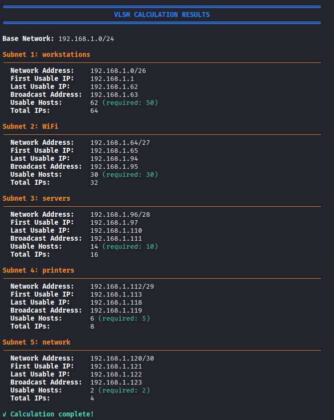
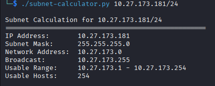

# Day 3-4: IP Addressing & Subnetting

## 📋 Overview

Mastered subnetting through intensive practice and real-world network design scenarios. Achieved ability to subnet any IP address in under 30 seconds using mental math.

---

## 🎯 Learning Objectives

✅ Convert binary ↔ decimal instantly  
✅ Understand IPv4 classes and structure  
✅ Calculate network/broadcast addresses  
✅ Design VLSM networks for organizations  
✅ Subnet any IP/CIDR in under 30 seconds  

---

## 📚 Subnetting Fundamentals

### **IPv4 Address Structure**
```
192.168.1.100
 │   │   │  └─ Host portion
 └───┴───┴──── Network portion (determined by subnet mask)

Binary: 11000000.10101000.00000001.01100100
Decimal: 192.168.1.100

Each octet = 8 bits = 0-255
Total = 32 bits
```

### **Subnet Mask Chart**

| CIDR | Mask | Block Size | Usable Hosts | Subnets in /24 |
|------|------|------------|--------------|----------------|
| /32 | 255.255.255.255 | 1 | 1 | 256 |
| /30 | 255.255.255.252 | 4 | 2 | 64 |
| /29 | 255.255.255.248 | 8 | 6 | 32 |
| /28 | 255.255.255.240 | 16 | 14 | 16 |
| /27 | 255.255.255.224 | 32 | 30 | 8 |
| /26 | 255.255.255.192 | 64 | 62 | 4 |
| /25 | 255.255.255.128 | 128 | 126 | 2 |
| /24 | 255.255.255.0 | 256 | 254 | 1 |
| /16 | 255.255.0.0 | 65,536 | 65,534 | - |
| /8 | 255.0.0.0 | 16,777,216 | 16,777,214 | - |

---

## ⚡ 30-Second Subnetting Method

### **The Process:**

**172.16.50.100/28**

**Step 1:** Mask = 255.255.255.240 --> **3 seconds**

**Step 2:** Block size = 256 - 240 = 16 --> **2 seconds**

**Step 3:** Subnets: 0, 16, 32, 48, 64, 80, 96... --> **5 seconds**
- .100 falls between 96 and 112
- Network = 172.16.50.96

**Step 4:** Broadcast = Next network - 1 = 111 --> **2 seconds**

**Step 5:** Usable range = 97-110 --> **3 seconds**

**Answer:**
```
Network: 172.16.50.96
Broadcast: 172.16.50.111
Usable: 172.16.50.97 - 172.16.50.110
Hosts: 14
```

**Total time: 15 seconds** ✓

---

---

## 🏢 Real-World Network Design

### **Scenario: Small Office Network**

**Requirements:**
- 50 workstations
- 10 servers
- 5 printers
- Management network
- Guest WiFi

**Given:** 192.168.1.0/24

**Solution (VLSM):**
```
Subnet 1: Workstations (50 hosts needed --> /26)
  192.168.1.0/26
  Network: 192.168.1.0
  Range: 192.168.1.1 - 192.168.1.62
  Hosts: 62 ✓

Subnet 2: Servers (10 hosts --> /28)
  192.168.1.64/28
  Network: 192.168.1.64
  Range: 192.168.1.65 - 192.168.1.78
  Hosts: 14 ✓

Subnet 3: Printers (5 hosts --> /29)
  192.168.1.80/29
  Network: 192.168.1.80
  Range: 192.168.1.81 - 192.168.1.86
  Hosts: 6 ✓

Subnet 4: Management (2 hosts --> /30)
  192.168.1.88/30
  Network: 192.168.1.88
  Range: 192.168.1.89 - 192.168.1.90
  Hosts: 2 ✓

Subnet 5: Guest WiFi (30 hosts --> /27)
  192.168.1.96/27
  Network: 192.168.1.96
  Range: 192.168.1.97 - 192.168.1.126
  Hosts: 30 ✓

Remaining: 192.168.1.128/25 (for future growth)
```

---

## Subnet Calculator Script
```python
#!/usr/bin/env python3
"""
subnet-calculator.py
Quick subnet calculator for any IP/CIDR
"""

def calculate_subnet(ip, cidr):
    """Calculate network, broadcast, and usable range"""
    
    # Convert IP to integer
    octets = [int(x) for x in ip.split('.')]
    ip_int = (octets[0] << 24) + (octets[1] << 16) + (octets[2] << 8) + octets[3]
    
    # Calculate subnet mask
    mask_int = (0xFFFFFFFF << (32 - cidr)) & 0xFFFFFFFF
    
    # Calculate network address
    network_int = ip_int & mask_int
    
    # Calculate broadcast address
    wildcard = 0xFFFFFFFF ^ mask_int
.........
```
Full [subnet-calculator.py](./subnet-calculator.py)

**Usage:**
```bash
./subnet-calculator.py 192.168.10.200/27

# Output:
Subnet Calculation for 192.168.10.200/27
==================================================
IP Address:       192.168.10.200
Subnet Mask:      255.255.255.224
Network Address:  192.168.10.192
Broadcast:        192.168.10.223
Usable Range:     192.168.10.193 - 192.168.10.222
Usable Hosts:     30
```

## VLSM calculator

```python
#!/usr/bin/env python3

import ipaddress
import math

class Colors:
    HEADER = '\033[95m'
    BLUE = '\033[94m'
    GREEN = '\033[92m'
    YELLOW = '\033[93m'
    RED = '\033[91m'
    END = '\033[0m'
    BOLD = '\033[1m'

def print_header(text):
    print(f"\n{Colors.BOLD}{Colors.BLUE}{'='*80}{Colors.END}")
    print(f"{Colors.BOLD}{Colors.BLUE}{text.center(80)}{Colors.END}")
    print(f"{Colors.BOLD}{Colors.BLUE}{'='*80}{Colors.END}\n")

def print_section(text):
    print(f"\n{Colors.BOLD}{Colors.GREEN}{text}{Colors.END}")
................
```

Full [VLSM calculator](VLSM-calculator.py)

---

## Subnetting Practice

**Completed 50+ problems from:**
- SubnettingPractice.com
- Textbook exercises
- Custom scenarios

---

## 📸 Screenshots

**Required:**
1. VLSM calculator output



2. Subnet calculator script output



---

## Deliverables

✅ **Skills Mastered:**
- Binary to decimal conversion (instant)
- Subnet any IP/CIDR in <30 seconds
- Design VLSM networks
- Create network diagrams

✅ **Tools Created:**
- Python subnet calculator
- Subnetting cheat sheet
- Practice problem sets

✅ **Documentation:**
- Subnetting methodology
- VLSM design examples
- Quick reference charts

---

*Completed as part of Week 1: Networking Fundamentals*