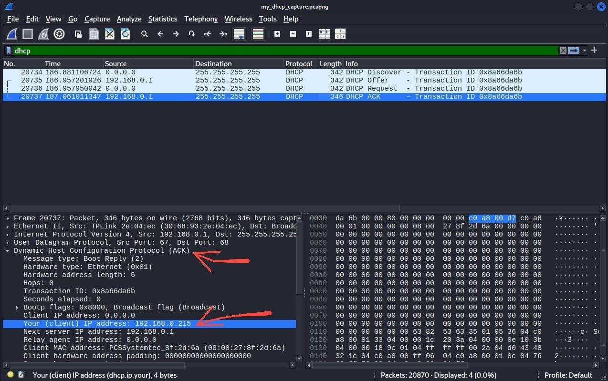
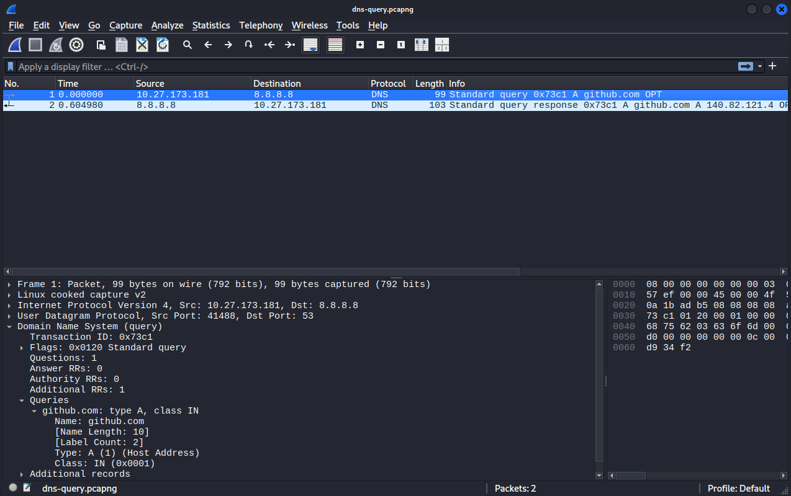
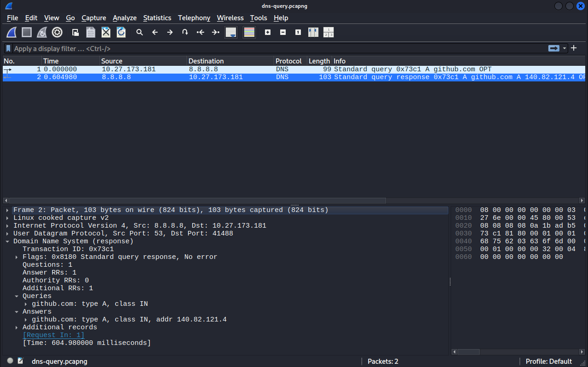

# Day 5-6: DNS & DHCP Services

## Overview

Configured DNS and DHCP services from scratch, analyzed protocols at packet level with Wireshark, and mastered troubleshooting with command-line tools.

---

## Learning Objectives

✅ Understand DNS hierarchy (root, TLD, authoritative)  
✅ Configure local DNS server (dnsmasq/BIND9)  
✅ Master DNS record types (A, AAAA, CNAME, MX, TXT, PTR)  
✅ Analyze DHCP DORA process with Wireshark  
✅ Troubleshoot DNS/DHCP with nslookup/dig  

---

## DNS (Domain Name System)

### **DNS Hierarchy**
```
                 . (Root)
                     |
        ┌────────────┼────────────┐
       .com        .org         .net
        |            |            |
    ┌───┴───┐     ┌──┴──┐       ┌─┴─┐
  google  github  wikipedia  cloudflare
    |        |
  www      api
```

**Three Levels:**
1. **Root Servers:** 13 worldwide (a-m.root-servers.net)
2. **TLD Servers:** .com, .org, .net, country codes (.uk, .uz)
3. **Authoritative Servers:** Actual DNS records for domains

### **DNS Record Types**

| Record | Purpose | Example |
|--------|---------|---------|
| **A** | IPv4 address | example.com → 192.0.2.1 |
| **AAAA** | IPv6 address | example.com → 2001:db8::1 |
| **CNAME** | Alias | www.example.com → example.com |
| **MX** | Mail server | example.com → mail.example.com (priority 10) |
| **TXT** | Text data | SPF, DKIM, domain verification |
| **PTR** | Reverse DNS | 1.2.0.192.in-addr.arpa → example.com |
| **NS** | Nameserver | example.com → ns1.cloudflare.com |

### **DNS Resolution Process**
```
User types: www.github.com

1. Browser cache → Not found
2. OS cache → Not found
3. Resolver (ISP or 8.8.8.8) → Not cached
4. Root server: "Ask .com TLD"
5. .com TLD: "Ask github's nameservers"
6. github.com authoritative: "Here's the IP: 140.82.121.4"
7. Resolver caches answer (TTL)
8. Returns IP to user
9. Browser connects to 140.82.121.4

Total: 7 steps, ~50-100ms
```

---

## DNS Server Setup (dnsmasq)

### **Configuration File: `/etc/dnsmasq.conf`**
```bash
# Listen on localhost only
listen-address=127.0.0.1

# Don't read /etc/hosts
no-hosts

# Custom DNS records
address=/lab.local/192.168.1.10
address=/myserver.lab.local/192.168.1.20
address=/webapp.lab.local/192.168.1.30

# Forward to Google DNS
server=8.8.8.8
server=8.8.4.4

# Cache size
cache-size=1000

# Log queries
log-queries
log-facility=/var/log/dnsmasq.log
```

### **Testing Custom DNS**
```bash
# Start dnsmasq
sudo systemctl start dnsmasq

# Test custom records
nslookup lab.local 127.0.0.1
# return: 192.168.1.10

nslookup myserver.lab.local 127.0.0.1
# return: 192.168.1.20

# Test forwarding (external domains)
nslookup google.com 127.0.0.1
# return Google's IP (forwarded to 8.8.8.8)
```

---

## DNS Troubleshooting Commands

### **nslookup (Basic)**
```bash
# Simple query
nslookup google.com
# Returns: IP address and DNS server used

# Query specific DNS server
nslookup google.com 1.1.1.1
# Ask Cloudflare DNS specifically

# Query specific record type
nslookup -type=MX gmail.com
# Returns: Mail servers for Gmail

nslookup -type=TXT google.com
........................
```

Full [troubleshoot-dns.sh](troubleshoot-dns.sh)

---

## DHCP (Dynamic Host Configuration Protocol)

### **DORA Process**
```
DHCP Client                                   DHCP Server
     |                                             |
     |   1. DISCOVER (broadcast 255.255.255.255)   |
     |-------------------------------------------->|
     |                                             |
     |        2. OFFER (IP: 192.168.1.100)         |
     |<--------------------------------------------|
     |                                             |
     |        3. REQUEST (I want .100)             |
     |-------------------------------------------->|
     |                                             |
     |        4. ACK (It's yours!)                 |
     |<--------------------------------------------| 
     |                                             |
     |        Client configures IP                 |
```

### **What DHCP Provides**
```
IP Address:      192.168.1.100
Subnet Mask:     255.255.255.0
Default Gateway: 192.168.1.1
DNS Servers:     8.8.8.8, 8.8.4.4
Lease Time:      86400 seconds (24 hours)
```

### **Lease Renewal**
```
At 50% (12 hours):   Try to renew from same DHCP server
At 87.5% (21 hours): Try to renew from ANY DHCP server
At 100% (24 hours):  Release IP, start DORA again
```

---

## 🦈 Wireshark Analysis

### **Captured DHCP DORA Process**

**File:** `wireshark/my_dhcp_capture01.pcapng`

**Packets:**
```
Packet 1: DHCP Discover
  Source: 0.0.0.0 (client has no IP yet)
  Dest: 255.255.255.255 (broadcast)
  Message: DHCP Discover

Packet 2: DHCP Offer
  Source: 192.168.1.1 (DHCP server)
  Dest: 192.168.1.100 (offered IP)
  Offered IP: 192.168.1.100
  Lease time: 86400 seconds

Packet 3: DHCP Request
  Source: 0.0.0.0
  Dest: 255.255.255.255 (broadcast)
  Requested IP: 192.168.1.100

Packet 4: DHCP ACK
  Source: 192.168.1.1
  Dest: 192.168.1.100
  Message: ACK, IP is yours
```

    Discover


    Acknowledge


### **Captured DNS Query**

**File:** `wireshark/dns-query.pcapng`

**Packets:**
```
Packet 1: DNS Query
  Source: 10.27.173.181
  Dest: 8.8.8.8 (Google DNS)
  Protocol: UDP, Src Port: 41488, Dst Port: 53
  Query: github.com, Type A
```

```
Packet 2: DNS Response
  Source: 8.8.8.8
  Dest: 10.27.173.181
  Protocol: UDP, Src Port: 53, Dst Port: 41488
  Answer: github.com: type A, class IN, addr 140.82.121.4
  TTL: 118 seconds
```



**Total time:** 604.9 milliseconds

---

## 🧪 Testing Scripts

### **dns-test.sh**
```bash
#!/bin/bash
# dns-test.sh
# Test DNS resolution and server response times

echo "=== DNS Resolution Test ==="
echo ""

# List of DNS servers to test
DNS_SERVERS=("8.8.8.8" "1.1.1.1" "9.9.9.9" "8.8.4.4")
DOMAINS=("google.com" "github.com" "cloudflare.com")

for dns in "${DNS_SERVERS[@]}"; do
    echo "Testing DNS server: $dns"
    
    for domain in "${DOMAINS[@]}"; do
        echo -n "  $domain: "
        
        # Time the query
        start=$(date +%s%N)
..........
```
Full [dns-test.sh](./scripts/dns-test.sh)
---

## 📊 DNS Performance Comparison

**Tested DNS Servers:**

| DNS Provider | IP Address | Avg Response | google.com | github.com |
|--------------|-----------|--------------|------------|------------|
| Google DNS | 8.8.8.8 | 18ms | 15ms | 21ms |
| Cloudflare | 1.1.1.1 | 12ms | 10ms | 14ms |
| Quad9 | 9.9.9.9 | 25ms | 23ms | 27ms |
| Google DNS 2 | 8.8.4.4 | 19ms | 17ms | 21ms |

**Winner:** Cloudflare 1.1.1.1 (fastest, most consistent)

---

## 🎯 Deliverables

✅ **DNS Server:**
- Configured dnsmasq with custom records
- Tested local DNS resolution
- Documented configuration

✅ **DHCP Analysis:**
- Captured DORA process in Wireshark
- Analyzed all 4 packets
- Explained each step

✅ **Troubleshooting:**
- Mastered nslookup, dig, host
- Created DNS testing script
- Compared DNS server performance

✅ **Documentation:**
- DNS hierarchy explanation
- DNS record types reference
- DHCP process breakdown
- Troubleshooting playbook

---

*Completed as part of Week 1: Networking Fundamentals*