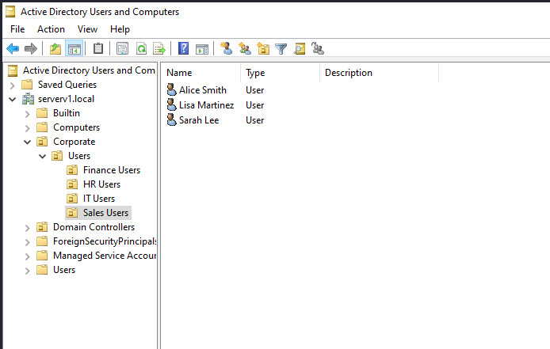
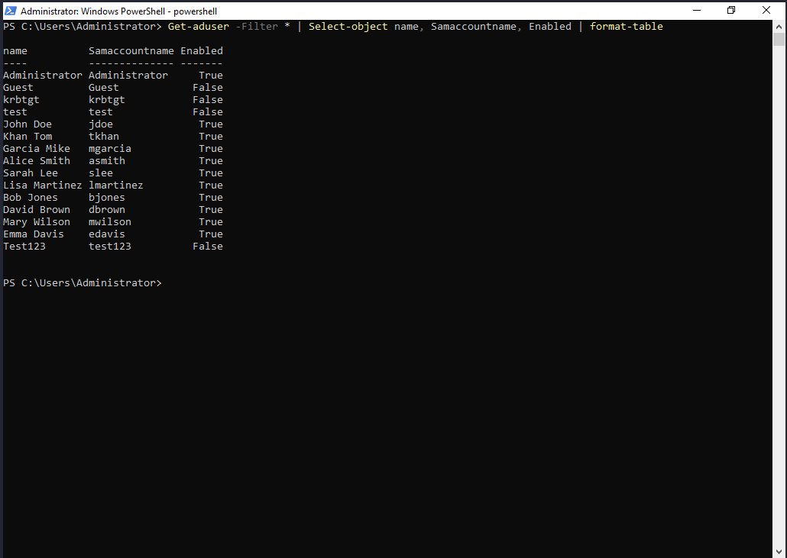
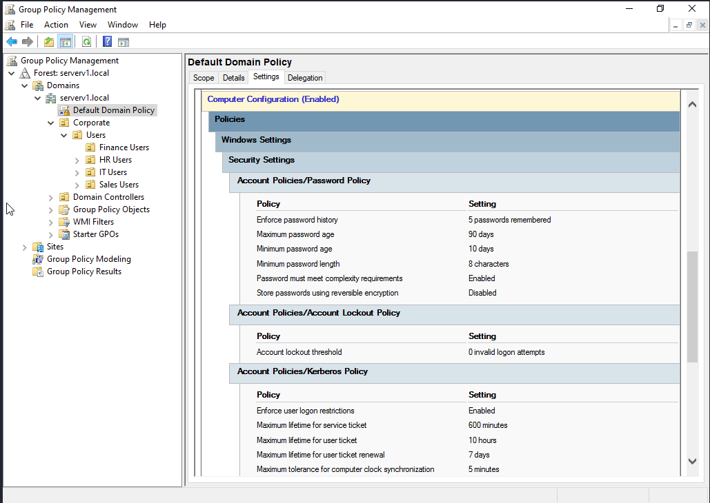

# Active Directory Domain Services Setup

## 📋 Project Overview

Built a complete Active Directory environment from scratch including domain controller installation, organizational structure, user management, and Group Policy configuration.

## 🎯 Objectives Completed

✅ Installed and configured AD Domain Services  
✅ Created hierarchical OU structure  
✅ Provisioned 10+ users across departments  
✅ Configured security groups with proper nesting  
✅ Implemented password policy via Group Policy  
✅ Documented entire process for repeatability  

## 🏗️ Infrastructure Details

**Domain Information:**
- **Domain Name:** lab.local (or your domain)
- **Forest Functional Level:** Windows Server 2016
- **Domain Controller:** WS2022-DC01
- **IP Address:** 192.168.1.10
- **DNS Server:** 192.168.1.10 (integrated with AD)

## 📊 Organizational Unit Structure
```
lab.local
│
├── Domain Controllers (default)
│
├── Corporate
│   ├── Departments
│   │   ├── IT
│   │   ├── Sales
│   │   ├── Finance
│   │   └── HR
│   │
│   ├── Users
│   │   ├── IT Users
│   │   ├── Sales Users
│   │   ├── Finance Users
│   │   └── HR Users
│   │
│   └── Groups
│       ├── Security Groups
│       └── Distribution Groups
│
└── Servers
    ├── Production
    └── Development
```

## 👥 Users Created

| Username | Department | OU Location | Group Membership |
|----------|-----------|-------------|------------------|
| jdoe | IT | IT Users | Domain Admins, IT-Staff |
| asmith | Sales | Sales Users | Sales-Team |
| bjones | Finance | Finance Users | Finance-Team |
| mwilson | HR | HR Users | HR-Team |
| tkhan | IT | IT Users | IT-Staff, Helpdesk |
| ... | ... | ... | ... |

*Full user list: [user-list.csv](./configs/user-list.csv)*

## 🔐 Group Policy Configuration

**Default Domain Password Policy:**
- ✅ Minimum password length: 8 characters
- ✅ Password complexity: Enabled
- ✅ Maximum password age: 90 days
- ✅ Enforce password history: 5 passwords remembered
- ✅ Account lockout threshold: 5 invalid attempts
- ✅ Lockout duration: 30 minutes

**Applied To:** All domain users  
**Scope:** Domain-wide via Default Domain Policy

## 🛠️ Installation Steps

### 1. Install AD DS Role
```powershell
# Install AD DS role and management tools
Install-WindowsFeature -Name AD-Domain-Services -IncludeManagementTools

# Promote server to Domain Controller
Install-ADDSForest `
    -DomainName "lab.local" `
    -DomainNetbiosName "LAB" `
    -ForestMode "WinThreshold" `
    -DomainMode "WinThreshold" `
    -InstallDns:$true `
    -SafeModeAdministratorPassword (ConvertTo-SecureString "YourPassword" -AsPlainText -Force) `
    -Force:$true

# Server will restart automatically
```

### 2. Create OU Structure

See script: [create-ou-structure.ps1](./scripts/create-ou-structure.ps1)
```powershell
# Example OU creation
New-ADOrganizationalUnit -Name "Corporate" -Path "DC=lab,DC=local"
New-ADOrganizationalUnit -Name "IT" -Path "OU=Departments,OU=Corporate,DC=lab,DC=local"
# ... (see full script)
```

### 3. Create Users

See script: [bulk-create-users.ps1](./scripts/bulk-create-users.ps1)
```powershell
# Import users from CSV
Import-Csv .\user-list.csv | ForEach-Object {
    New-ADUser `
        -Name "$($_.FirstName) $($_.LastName)" `
        -GivenName $_.FirstName `
        -Surname $_.LastName `
        -SamAccountName $_.Username `
        -UserPrincipalName "$($_.Username)@lab.local" `
        -Path $_.OUPath `
        -AccountPassword (ConvertTo-SecureString $_.Password -AsPlainText -Force) `
        -Enabled $true
}
```

### 4. Configure Group Policy

**Via GUI:**
1. Server Manager → Tools → Group Policy Management
2. Default Domain Policy → Edit
3. Computer Configuration → Policies → Windows Settings → Security Settings → Account Policies → Password Policy
4. Configure settings (see screenshot below)

**Via PowerShell:**
```powershell
# Set password policy
Set-ADDefaultDomainPasswordPolicy `
    -Identity lab.local `
    -MinPasswordLength 8 `
    -ComplexityEnabled $true `
    -MaxPasswordAge 90.00:00:00 `
    -PasswordHistoryCount 5
```

## 📸 Screenshots

### AD DS Installation


### Domain Structure


### OU Hierarchy


### Users Created


### Security Groups


### Password Policy GPO


## 🧪 Testing & Verification

**Verify AD DS Installation:**
```powershell
Get-ADDomainController
Get-ADDomain
Get-ADForest
```

**Verify Users:**
```powershell
Get-ADUser -Filter * | Select-Object Name, SamAccountName, Enabled
```

**Verify OUs:**
```powershell
Get-ADOrganizationalUnit -Filter * | Select-Object Name, DistinguishedName
```

**Test Password Policy:**
```powershell
# This should FAIL (password too weak)
New-ADUser -Name "Test" -SamAccountName "test" `
    -AccountPassword (ConvertTo-SecureString "123" -AsPlainText -Force)
# Expected: Error about password complexity ✓
```

## 📚 What I Learned

### Technical Skills
- Installing and configuring Windows Server roles
- Active Directory architecture (forests, domains, OUs)
- LDAP concepts and directory services
- Group Policy management and application
- PowerShell automation for AD administration
- DNS integration with Active Directory
- User and group management best practices

### Best Practices Implemented
- Hierarchical OU structure for scalability
- Security group nesting (users → groups → permissions)
- Strong password policy enforcement
- Separation of user/computer objects
- Proper naming conventions
- Documentation for reproducibility

### Troubleshooting Experience
- DNS not resolving after DC promotion → Fixed: Set DNS to loopback
- GPO not applying → Fixed: Ran `gpupdate /force`
- Users can't login → Fixed: Ensured "User must change password at next logon" was cleared

## 🔄 Next Steps

- [ ] Configure additional GPOs (desktop settings, software deployment)
- [ ] Set up second Domain Controller for redundancy
- [ ] Implement DHCP integration with AD
- [ ] Create file shares with AD permissions
- [ ] Configure FSMO roles management
- [ ] Set up AD recycle bin

## 📂 Files in This Project
```
active-directory-setup/
├── README.md (this file)
├── screenshots/
│   ├── 01-ad-installation.png
│   ├── 02-domain-structure.png
│   ├── 03-ou-structure.png
│   ├── 04-users-created.png
│   ├── 05-groups-created.png
│   └── 06-gpo-password-policy.png
├── scripts/
│   ├── create-ou-structure.ps1
│   ├── bulk-create-users.ps1
│   └── create-security-groups.ps1
└── configs/
    └── user-list.csv
```

## 🔗 Related Projects

- [Windows Server Basic Configuration](../basic-server-config/)
- [DNS Server Setup](../dns-setup/) *(coming soon)*
- [File Server with Permissions](../file-server/) *(coming soon)*

---

*Project completed as part of 10-week sysadmin training program*  
*Date: [Current Date]*
